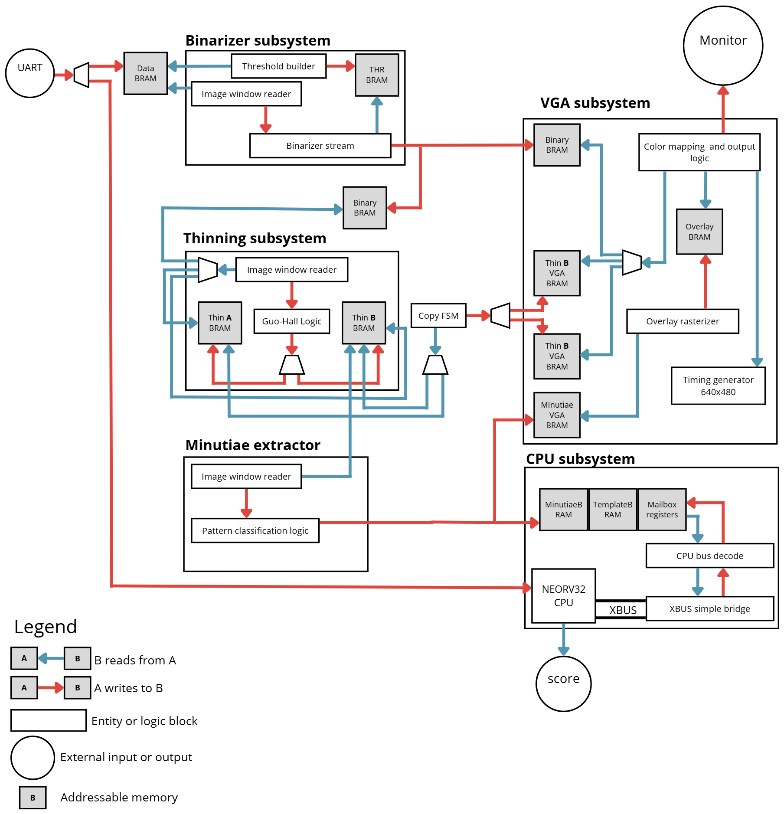

# FPGA Fingerprint Recognition System

## Overview

This project implements a complete fingerprint recognition pipeline on a Digilent Nexys 4 DDR board, featuring an Artix-7 FPGA and an embedded NEORV32 RISC-V soft processor.

The system receives a grayscale fingerprint image over a UART interface, performs a multi-stage image processing and feature extraction routine entirely in hardware, and then executes a matching algorithm in software on the embedded CPU.

A VGA interface provides a real-time view of the image as it passes through the processing stages, and the final similarity score is displayed on the board's seven-segment display. This hybrid hardware/software co-design demonstrates a powerful approach to balancing performance and flexibility for embedded vision tasks.

## Features

-   **Hardware-Accelerated Pipeline:** Image binarization, skeletonization (thinning), and minutiae extraction are performed by dedicated VHDL modules for maximum performance.
-   **Software-Based Matching:** A lightweight, 32-bit NEORV32 RISC-V soft processor runs a C-based firmware to perform the final, more complex task of matching extracted features against stored templates.
-   **UART Image Upload:** Users can send a 68x118 pixel, 8-bit grayscale image (8024 bytes) to the board via a standard serial connection (19200 baud).
-   **Live VGA Output:** A 640x480 VGA output shows the image at different stages. Onboard switches allow the user to select one of the following views:
    -   The binarized (black & white) image.
    -   The thinned image (skeleton) from one of the two ping-pong buffers.
    -   The final thinned image with detected minutiae (ridge endings and bifurcations) overlaid as colored markers.
-   **On-Board I/O:**
    -   Switches control the VGA mode and operational mode (e.g., enroll vs. match).
    -   Push-buttons start and step through the processing pipeline.
    -   The seven-segment display shows the final matching score.
    -   LEDs provide system status.

## System Architecture

The system is managed by a top-level control unit (`control_unit.vhd`) that orchestrates the flow of data through the hardware accelerators and initiates the software routine. The primary clock domain for processing is 50 MHz (`clk_sys`), while the VGA subsystem operates at 25 MHz (`clk_pix`). Data is passed between stages and across clock domains using dual-port Block RAMs (BRAMs).

### 1. Binarizer Subsystem
-   **Input:** Grayscale image from a source BRAM.
-   **Processing:** Implements a two-pass, block-based adaptive thresholding algorithm. It first computes an average brightness for each 8x8 block in the image, then uses that local threshold to convert the grayscale pixels to binary (black or white).
-   **Output:** The binary image is written to a dedicated BRAM. To decouple the pipeline, this write is mirrored to a separate "bridge" BRAM that serves as the input for the next stage.

### 2. Thinning Subsystem
-   **Input:** Binary image from the binarizer's bridge BRAM.
-   **Processing:** Implements an iterative Guo-Hall thinning algorithm to reduce the fingerprint ridges to a one-pixel-wide skeleton. This process uses two "ping-pong" BRAMs (`thinA_bram`, `thinB_bram`) to pass the image back and forth between sub-iterations.
-   **Output:** The final skeletonized image resides in one of the thinning BRAMs.

### 3. Minutiae Extractor
-   **Input:** The final skeleton image from the thinning subsystem.
-   **Processing:** Scans the skeleton with a 3x3 window to identify fingerprint features. It uses a crossing-number calculation to classify pixels as:
    -   **Ridge Ending:** A ridge terminates (Crossing Number = 1).
    -   **Bifurcation:** A ridge splits into two (Crossing Number = 3).
-   **Output:** A list of 32-bit feature records (containing type, x/y coordinates) is written to the Feature BRAM.

### 4. CPU Subsystem & Matching
-   **Core:** A `NEORV32` soft processor with its own instruction and data memory.
-   **Bus Architecture:** The CPU communicates with the rest of the system via its `XBUS` interface. An `xbus_simple_bridge` converts XBUS transactions to a simpler memory-mapped protocol, which is then decoded by `cpu_bus_decode`. This provides the CPU with access to three key memory regions:
    1.  **Feature BRAM (`0x20000000`):** The list of freshly extracted minutiae (read-only for the CPU).
    2.  **Template BRAM (`0x30000000`):** A persistent memory holding the feature lists of enrolled fingerprints (read/write).
    3.  **Mailbox (`0x40000000`):** A set of registers used for command/status communication between the hardware control unit and the CPU firmware.
-   **Operation:** The hardware control unit "kicks" the CPU by writing a command to the mailbox and raising an interrupt. The CPU firmware then reads the features, compares them against templates, and writes a score back to the mailbox.

### 5. VGA Subsystem
-   **Function:** Generates 640x480 VGA timing and displays the selected image, scaled up by a factor of 4.
-   **Clock Domain Crossing (CDC):** The VGA subsystem operates in a separate pixel clock domain. It never reads directly from the main processing BRAMs. Instead, it reads from dedicated, mirrored BRAMs (`..._vga_bram`) that are populated by a copy state machine after a processing stage is complete. This prevents visual artifacts and timing issues.
-   **Overlay Logic:** After minutiae extraction is done, a rasterizer FSM reads the feature list from the mirrored `min_bram_vga` and draws colored markers (crosses/Xs) into an overlay RAM, which is then composited on top of the base image.

## Building and Using the System

This repository contains a Vivado project.

-   **Target Device:** Digilent Nexys 4 DDR (Xilinx Artix-7 FPGA)
-   **Top-Level File:** `top_nexys4ddr.vhd`

### Basic Operation
1.  **Synthesize and Program:** Generate the bitstream in Vivado and program the Nexys 4 DDR board.
2.  **Upload Firmware:** Load the C firmware for the NEORV32 CPU (if not already embedded in the bitstream).
3.  **Connect Serial:** Connect to the board's USB-UART port with a terminal at 19200 baud.
4.  **Send Image:** Send a raw 68x118 (8024 bytes) 8-bit grayscale image file through the serial connection.
5.  **Select View:** Use `SW[3:2]` to select the desired image to display on the VGA monitor.
6.  **Start Processing:** Press `BTNC` to initiate the full hardware/software pipeline. Use `BTNR` to single-step through stages if enabled.
7.  **View Results:** The final match score appears on the seven-segment display. The VGA output will update to show the processed image with minutiae markers.
